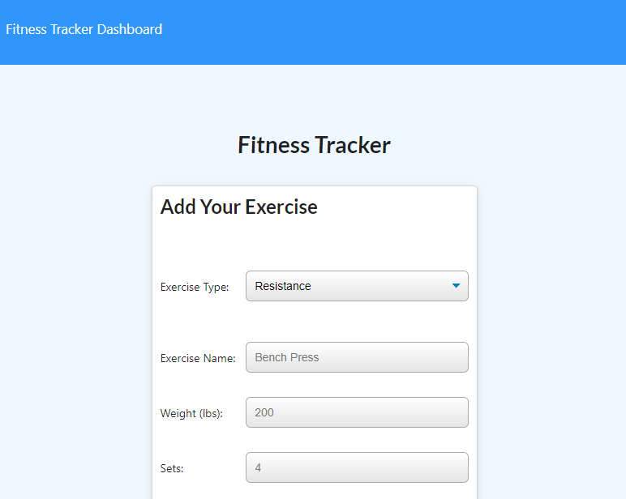

# Fitness Tracker
Allows the user to track a workout. Various attributes of the workout can be stored. The workouts are saved in a Mongo database.

## Description 
Created a fitness tracking app using Node.js, Express.js, MongoDB, Heroku and Mongoose that allows the user to track their workouts and save them in a database.

## Live site: 

## Images

